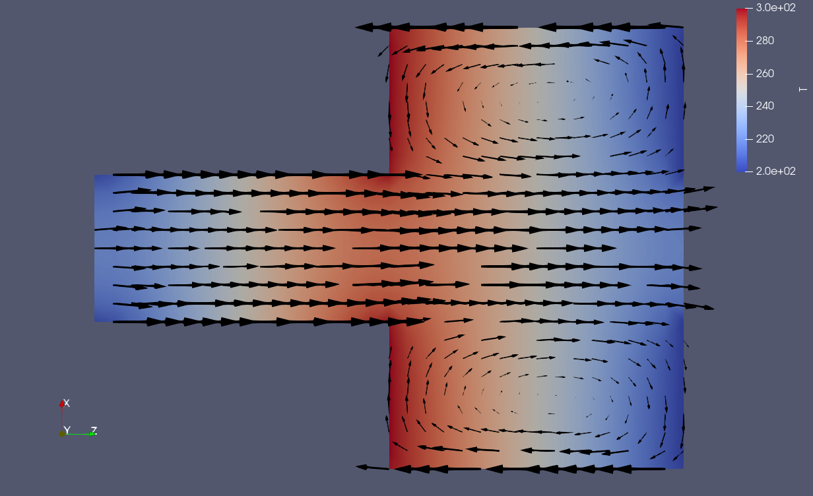

# Knudsen Pump Gas Flow Modeling

This project focuses on simulating the flow of rarefied gas mixtures, specifically modeling the operation of Knudsen pumps. The main objective is to implement a computational model to analyze the efficiency of the gas mixture flow within the pump, leveraging high-level programming languages and standard libraries.

## Introduction

The Knudsen pump is a device designed to create thermally induced flows in rarefied gas conditions. The main advantage of such pumps is the absence of moving parts, which simplifies their creation and increases reliability. This project uses the quasi-gas dynamic (QGD) equations to model the behavior of gas mixtures in the pump.

### Key Features
- **High Efficiency**: Knudsen pumps are highly energy-efficient due to the lack of moving mechanical elements.
- **Versatility**: Suitable for a variety of energy sources, including thermal, solar, and electrical.
- **Scalability**: Easily scalable by adjusting the size of the channels and temperature gradients.


### Directory Layout

```
.
├── 0
│   ├── p
│   ├── T
│   └── U
├── 0.orig
│   ├── p
│   ├── T
│   └── U
├── Allclean
├── Allrun
├── constant
│   ├── thermophysicalProperties
│   └── turbulenceProperties
└── system
    ├── blockMeshDict
    ├── controlDict
    ├── decomposeParDict
    ├── fvSchemes
    └── fvSolution
```

- **0**: Initial conditions for pressure (`p`), temperature (`T`), and velocity (`U`).
- **0.orig**: Original initial conditions for pressure (`p`), temperature (`T`), and velocity (`U`).
- **Allclean**: Script to clean the simulation directory.
- **Allrun**: Script to run the simulation.
- **constant**: Contains physical properties and turbulence models.
- **system**: Contains configuration files for the simulation, including mesh generation (`blockMeshDict`), simulation control (`controlDict`), parallel decomposition (`decomposeParDict`), numerical schemes (`fvSchemes`), and solver settings (`fvSolution`).

## Installation

To install and run the project, follow these steps:

1. Clone the repository:
   ```bash
   git clone https://github.com/username/KnudsenPump.git
   
   cd KnudsenPump
   ```

2. Set up the necessary software environment (e.g., OpenFOAM).

## Usage

To run the simulation, execute the following command in the project directory:
```bash
./Allrun
```

To clean the simulation directory, use:
```bash
./Allclean
```

## Results

The simulation results show the temperature distribution and the direction of the gas flow in the Knudsen pump. The efficiency of the pump can be analyzed by varying the geometry of the channels, the gas mixture ratios, and the temperature gradients.



